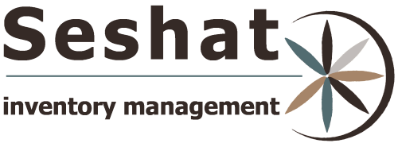

SESHAT is an inventory management open source we-application based on django. it's suitable for small business.

**Features:**

* Store items in different locations
* Can create an assembled item
* Categories the items
* Store all customers and vendors data
* Create purchase/sell order
* Backup/Restore database
* Import/Export application modules' data
* Store all users activities
* Control all modules with permissions

**Install:**

* Install dependents
pip install -r requirments.txt

* Migrate the project
python manage.py makemigrations
python manage.py Migrate

* Create superuser
python manage.py createsuperuser

**TESTS:**
* Detailed unit test for all applications
* Web test using selenium
